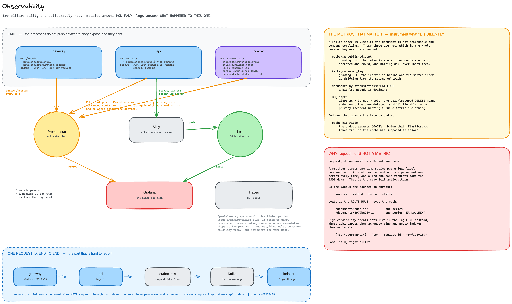

# Distributed Document Search — Design

A prototype multi-tenant document search service: 10M+ documents, full-text
search with relevance ranking, p95 under 500 ms, 1000+ searches/sec, tenant
isolation, horizontal scale.

Working code and a Postman collection are in this repository — see the
[README](README.md).

[](https://www.loom.com/share/5a0ed4dddc584da3822e1221f36f6a6a) [](https://www.loom.com/share/eabddd520637489ea87d590c932dc4b2) [](https://www.loom.com/share/b500cedbf4aa4f3f84798247edb2cd8e)

| | |
| --- | --- |
| [1 · Architecture design](#1--architecture-design) | components, data flow, storage, API, consistency, caching, queue |
| [2 · Production readiness](#2--production-readiness) | scale, resilience, security, observability, performance, operations, SLA, cost |
| [3 · Experience showcase](#3--experience-showcase) | |

---

# 1 · Architecture design

## Where the design comes from

Three requirements settle most of it:

- **p95 under 500 ms at 1000 QPS.** The search path gets one datastore. Joining
  across two is already over budget.
- **10M+ documents, multi-tenant.** Tenant is a query-time filter, not a
  topology decision. One index with routing, not an index per tenant.
- **Documents, not strings.** Real files arrive — PDF, DOCX, HTML. Extraction is
  slow and fails in interesting ways, so it cannot sit on the write path.

The last one forces the shape of everything else: writes are asynchronous, reads
are synchronous. Upload returns `202` once the bytes are durable, and indexing
happens behind a queue.


## Components

| | Role | Why |
| --- | --- | --- |
| Gateway | auth, request id, rate limit | one place mints identity; nothing downstream trusts a client header |
| API | document, index, search blueprints | one deployable, three packages — splits later without a rewrite |
| Postgres | source of truth | transactions and a real consistency story |
| Elasticsearch | search index | BM25, analyzers, highlighting, faceting |
| S3 (MinIO) | document bytes | blobs do not belong in a row |
| Kafka | async boundary | "indexer is down" becomes lag, not loss |
| Redis | L2 cache, rate limits | shared ephemeral state |

Postgres full-text search would work at 10M documents. It loses on per-field
relevance tuning (`title^3`), analyzer control, and read scale — it grows by
making one box bigger, and the brief asks for horizontal growth.

Postgres stays the source of truth and Elasticsearch is derived. That one
decision is why the index needs no backups, why a mapping change is safe, and
why search survives a Postgres outage.

## Database design

### Postgres — the source of truth

```mermaid
erDiagram
    TENANTS ||--o{ TENANT_DOMAINS : has
    TENANTS ||--o{ USERS : has
    TENANTS ||--o{ DOCUMENTS : owns
    DOCUMENTS ||--o{ INDEX_OUTBOX : "queues an event for"

    TENANTS {
        uuid tenant_id PK
        string namespace UK "immutable, physical key everywhere else"
        string display_name
        string status "ACTIVE | SUSPENDED"
        int rate_limit_rpm
        smallint index_group "escape hatch: promote a whale to its own ES index"
        timestamp created_at
    }

    TENANT_DOMAINS {
        string domain PK
        uuid tenant_id FK
        timestamp verified_at
        timestamp created_at
    }

    USERS {
        uuid user_id PK
        uuid tenant_id FK
        string email UK
        string password_hash
        timestamp created_at
    }

    DOCUMENTS {
        string tenant PK_FK "references tenants.namespace, not tenant_id"
        uuid doc_id PK
        string title
        text body "NULL if the bytes live in S3 instead"
        text s3_key "NULL if the body is inline"
        string content_type
        bigint byte_size
        jsonb metadata
        bigint version "guards against a stale event overwriting a newer one"
        string status "PENDING | LIVE | FAILED | DELETED"
        text failure_reason
        timestamp created_at
        timestamp updated_at
    }

    INDEX_OUTBOX {
        bigint seq PK
        uuid doc_id
        string tenant
        string op "UPSERT | DELETE"
        bigint version
        string request_id "traces one document across the Kafka boundary"
        timestamp published_at "NULL until the relay hands it to Kafka"
        timestamp created_at
    }
```

Two choices in that diagram are easy to miss and both matter:

**`documents` is keyed on `(tenant, doc_id)`, not `doc_id` alone.** Every query
that fetches a document already has to name a tenant to hit the primary key at
all, so a wrong-tenant lookup returns no rows rather than depending on a handler
remembering to add a `WHERE tenant = …` clause. The isolation is structural, not
a habit.

**`documents.tenant` references `tenants.namespace`, not `tenants.tenant_id`.**
The UUID is the durable identity; the namespace is the short, readable string
used as a physical key everywhere — S3 prefixes, Elasticsearch's tenant filter,
Redis key prefixes, log lines. Foreign-keying on it here means every document
row is human-readable without a join, at the cost of namespace being unable to
ever change. That trade was made deliberately: an identity you can rename is an
identity you eventually have to migrate everywhere it was copied.

`body` and `s3_key` are mutually exclusive by a `CHECK` constraint — exactly one
is set, never both, never neither. That one line is what makes "where are the
bytes?" always answerable by looking at a single row instead of trying both
places.

`index_outbox` exists only so a document row and its "tell Kafka about this" row
can commit in one transaction — see [Indexing](#indexing). Production replaces
this table with Debezium reading the write-ahead log directly; nothing else in
the schema changes.

### Elasticsearch — the derived index

Not a second database with its own migrations; a mapping, rebuildable at any
time from the two tables above plus S3.

| Field | Type | Why this type |
| --- | --- | --- |
| `tenant` | `keyword` | exact-match only, never analyzed — this is what the isolation filter matches on |
| `doc_id` | `keyword` | exact-match, used to `GET` a specific document |
| `title` | `text` + `keyword` subfield | `text` for ranked search, the `keyword` copy for exact-match or sorting |
| `body` | `text` | the analyzed, searchable content |
| `metadata` | `flattened` | arbitrary per-tenant fields (department, project, …) without a mapping change each time a new one appears |
| `version` | `long` | the number `version_type=external` checks against, so a redelivered old event cannot overwrite newer data |
| `created_at` | `date` | sorting and range filters |

One index, shared by every tenant, with `routing=tenant` — documents for one
tenant land on one shard, so a search touches one shard instead of all of them.
The consequence for the mapping: `tenant` must be a `keyword`, because routing
and the isolation filter both need an exact match, not a tokenized one.

## Indexing


[](https://www.loom.com/share/5a0ed4dddc584da3822e1221f36f6a6a)

```
POST /documents  →  bytes durable  →  row + outbox row (one txn)  →  202
                                             │
                   Kafka  ◀── relay ─────────┘
                     │
                  Indexer  →  extract  →  S3 /text  →  Elasticsearch
                                                          │
                                        INCR inv:{tenant} ┘  → status LIVE
```

Three rules:

1. **S3 lands before the row.** A row can never point at bytes that are not
   there. The reverse leaves an orphan blob, which is harmless.
2. **Row and outbox row commit together.** No dual write, so there is no window
   where Postgres has a document and Kafka never hears about it. Production uses Debezium,
   which reads Postgres's write-ahead log (the WAL — the sequential record of
   every change, which Postgres already keeps for crash recovery); the prototype
   polls the outbox table with `FOR UPDATE SKIP LOCKED`.
3. **`/raw` is immutable, `/text` is derived.** A reindex reads the extracted
   text instead of re-parsing 10M PDFs.

Size decides the path, and the server decides, never the client: at or under
256 KB the body sits in the row, above that it goes to S3, and above 5 MB the
client would PUT it to S3 directly against a presigned URL (designed, not built
— the prototype streams through the API).

A scanned PDF with no text layer becomes `FAILED: needs OCR` rather than an
empty document that silently matches nothing. Full detail in
[index-flow.md](resources/index-flow.md).

## Search


[](https://www.loom.com/share/eabddd520637489ea87d590c932dc4b2)

```
GET /search  →  L1 (in-process, 5s)  →  L2 (Redis, 60s)  →  Elasticsearch
                    ~0.1 ms                  ~2 ms            60–120 ms
```

Search touches neither Postgres nor S3. Titles, snippets and metadata all come
from Elasticsearch stored fields, which is what keeps the hot path on one
datastore — and, incidentally, why search stays up when Postgres does not.

```json
POST /docs/_search?routing=acme
{
  "query": { "bool": {
    "filter": [ { "term": { "tenant_id": "acme" } } ],
    "must":   [ { "multi_match": { "query": "refund",
                                   "fields": ["title^3", "text"],
                                   "fuzziness": "AUTO" } } ]
  }},
  "highlight": { "fields": { "text": {} } }
}
```

`routing` means one shard answers instead of 24 — the main reason the budget
holds. The tenant term is a `filter` rather than a `must` so it is unscored and
cached as a bitset. `title^3` makes a title match count triple.

Fuzzy matching, highlighting and faceting come free with the engine choice.
Full detail in [search-flow.md](resources/search-flow.md).

## Fetch, download and delete


`GET /documents/{id}` reads Postgres, not Elasticsearch — it is the endpoint
clients poll straight after writing, so it is the one read that must be
strongly consistent. That also rules out serving it from a read replica.

Bytes never travel inside a JSON response. A small body is already in the row
and comes back inline; anything in S3 becomes a link, and
`GET /documents/{id}/raw` answers `302` with a presigned URL valid for 60 s.
Presigning is a local HMAC, so the service hands out the URL without touching
the object — identical work at 20 KB or 200 MB.

Delete is soft. The row moves to `DELETED` and the same outbox-and-Kafka path
carries the removal to Elasticsearch, which is why deletes cannot overtake the
updates in front of them. A retention job hard-deletes later; the indexer
ignores those events because the index was already cleaned when the status
changed.

## Multi-tenancy

Four layers, so no single mistake is enough:

```
gateway   tenant comes from the JWT claim; an inbound header is never read
service   each verifies the token again — reaching a service directly proves nothing
query     term filter injected by the repository; handlers cannot build an unscoped query
cache     every Redis key is tenant-prefixed
```

The cache layer is the one people forget. A key of `sha1(query)` alone serves
one tenant's results to another.

Cross-tenant reads return **404, not 403**. A 403 confirms the document exists,
which turns id enumeration into a leak.

Elasticsearch routing co-locates a tenant on one shard, but routing is an
optimisation, not isolation — the `term` filter is what enforces it.

## API

Tenancy is never a URL parameter; it is a JWT claim the gateway converts into a
header, stripping any the client sent.

| | |
| --- | --- |
| `POST /auth/login` | → `{ access_token, expires_in }` |
| `POST /documents` | multipart or JSON → `202 { doc_id, status }` |
| `GET /documents` | paginated list |
| `GET /documents/{id}` | metadata, or bytes via `Accept` |
| `GET /documents/{id}/raw` | `302` to a presigned S3 URL, 60 s |
| `DELETE /documents/{id}` | soft delete, propagates to the index |
| `GET /search?q=&page=&size=` | the hot path |
| `GET /health` `/health/detail` `/metrics` | operational |

```jsonc
// GET /search?q=refund
{ "total": 42, "took_ms": 9, "cache": "hit",
  "results": [
    { "doc_id": "…", "title": "Refund Policy", "score": 8.41,
      "highlight": "…may request <em>refunds</em> within 30 days…" } ] }
```

Errors are RFC 7807 and carry the `X-Request-Id` that also appears in the logs
on both sides of Kafka. Contracts and 29 assertions are in the
[Postman collection](postman/deeprunner.postman_collection.json).

## Consistency — when can you read back what you just wrote?

That is the whole question this section answers. You upload a document. A second
later you search for it. Is it there?

There are two honest answers a system can give:

- **Immediately.** The write is not finished until everyone can see it. Simple to
  reason about, but the write has to wait for every system that stores a copy.
- **Shortly.** The write finishes as soon as the data is safe, and other systems
  catch up a moment later. Faster writes, but there is a window where two parts
  of the system disagree.

We give different answers for different reads, on purpose:

| You do this | You see it | Because |
| --- | --- | --- |
| Upload, then open the document | immediately | it reads Postgres, where the write landed |
| Upload, then search for it | after ~1 second | search reads Elasticsearch, which is updated in the background |

### Why not make search immediate too

Making search immediate means indexing before responding to the upload. Indexing
means opening the PDF and extracting its text, which is slow and can fail. So
every upload would wait on it, and an Elasticsearch problem would fail uploads
that had already been safely stored.

We would be paying that on every upload to solve a problem almost nobody has.
People do not upload a document and immediately full-text search for it. They do
immediately *open* it — which is exactly the read we kept instant.

### Making the gap visible

A one-second window where a document exists but is not findable is only
dangerous if it is invisible. So the document carries a status the UI shows:

```
PENDING  →  LIVE            stored, then searchable
PENDING  →  FAILED          with the reason, e.g. "needs OCR"
```

Nobody has to guess whether the system is slow or broken.

### Why the same document never gets indexed twice, wrongly

The queue guarantees each message is delivered *at least* once — on a network
hiccup it may deliver the same one again. So every operation is written to be
safe to repeat:

- Indexing writes the document *at* its id rather than adding a new one. Running
  it twice leaves exactly one document.
- Deleting something already deleted does nothing rather than erroring.
- Each document carries a version number, and Elasticsearch rejects any update
  carrying an older version than the one it already has. A delayed message
  cannot overwrite newer data.

Without that third rule a redelivered old message could quietly undo a newer
edit, which is the kind of bug that surfaces weeks later as "this document keeps
reverting".

### What this costs

About a second before a document is searchable. An index of roughly 600 GB
holding a copy of what Postgres already has. Code that must tolerate the same
message arriving twice. And up to five seconds of cache staleness, covered next.

## Caching

| | Where | TTL | Invalidation |
| --- | --- | --- | --- |
| L1 | in-process LRU | 5 s | none, it expires |
| L2 | Redis | 60 s | version counter |
| ES | shard request cache, filter bitsets | — | automatic |

L1 absorbs bursts — fifty people searching the same term in five seconds produce
one L2 lookup. Its TTL is short because it cannot be invalidated: there is no
cheap way to tell twenty pods to drop a key, so staleness is bounded instead.

Invalidation is one integer. The key embeds a version:

```
q:{tenant}:{version}:{sha1(q|filters|page|size|sort)}
```

The indexer runs `INCR inv:acme` when a document lands, so every later key is
built at `:8:` and every `:7:` key is unreachable. No `SCAN`, no enumeration.

Everything that changes the answer goes in the key and nothing else does. Drop
`page` and page 2 serves page 1; add `request_id` and the hit rate is zero; drop
`tenant` and it is a data leak.

Measured: ~90% hit rate under load, so ~350 of 1000 QPS reach Elasticsearch.

## Message queue

One topic, `doc.index.v1`, 32 partitions, keyed on `doc_id`. Tenant is a field
in the message, not topology — topic-per-tenant makes signup an infrastructure
operation and turns 32 partitions into 32,000.

The key is the opposite of the Elasticsearch routing key on purpose. Routing
co-locates a tenant; Kafka spreads work, and keying on tenant would drop a whale
tenant's corpus into one partition while 31 sit idle. `doc_id` still preserves
the only ordering that matters — `UPSERT v1 → UPSERT v2 → DELETE v3` for one
document lands in one partition, in order. Reorder those and the delete
overtakes v2, resurrecting the document. Deletes share the topic for the same
reason: a soft delete is an `UPDATE`, so splitting it out would lose that
ordering.

Failures are classified before they are retried. An encrypted PDF retried five
times reaches the same answer several minutes later, so permanent failures go
straight to `FAILED`. Transient ones move through a 30 s / 5 m / 30 m ladder on
separate topics, so the main partition commits and keeps moving; the window
outlasts a rolling Elasticsearch restart. Anything still failing after the last
rung goes to a dead-letter queue (DLQ) — a topic of messages that need a human. If Elasticsearch is down entirely,
pause the consumer and let lag build rather than retrying 50,000 messages.

A failed delete is worse than a failed index — a missing document gets
complaints, a deleted-but-findable one gets silence. Alert on DLQ depth above
zero.

---
# 2 · Production readiness

Written against what is actually built. Where something exists it says so.

## 2.1 Scale — surviving 100×

100× is 1B documents and 100k searches/sec. Full derivation in
[sizing.md](resources/sizing.md).

| | Today | At 100× | Changes shape? |
| --- | --- | --- | --- |
| Elasticsearch | 6 data nodes, 24 shards, 600 GB | ~60 TB, ~200 nodes, hot/warm tiers | yes |
| Kafka | 32 partitions | partition count is the ceiling | yes |
| API | 6 pods | ~100 pods | no |
| Postgres | one primary, 15 GB | ~1.5 TB, hash partitioning | somewhat |
| Redis | 3 nodes | ~21 GB, 6-shard cluster | no |

Only two things genuinely change shape.

Elasticsearch at 60 TB does not sit on one tier. Recent documents stay on hot
nodes; older ones move to warm. Tenants above ~5M documents get their own index
via `tenants.index_group`, a column that exists today, unused, so this needs no
migration.

Kafka partitions cap consumer parallelism at one consumer each, so 32 partitions
means at most 32 indexer pods. Adding partitions rehashes `key → partition`, and
a document's events can briefly straddle old and new. Survivable — the version
guard drops stale events — but it is a planned operation. Size for the ceiling
you expect.

Everything else scales by adding replicas, because session, cache and identity
all live outside the process.

The initial backfill is the exception. Indexing 1B documents at ~1 s of
extraction CPU each is ~30 CPU-years — a migration project with its own capacity
plan, not a deployment.

## 2.2 Resilience — staying useful when something breaks

**The problem.** This system has six moving parts, and in production something is
always slightly broken. The question is not how to prevent that; it is what the
user experiences when it happens.

The wrong answer is that any single failure takes the whole service down.

### What still works when each piece is down

Worth deciding before an incident rather than during one:

| Broken | Search | Upload | Fetch a document |
| --- | --- | --- | --- |
| Redis | ✅ slower | ✅ | ✅ |
| Elasticsearch | ❌ | ✅ | ✅ |
| Kafka | ✅ | ✅ | ✅ |
| Indexer | ✅ | ✅ | ✅ |
| S3 | ✅ | ⚠ small files only | ⚠ metadata only |
| Postgres | ✅ | ❌ | ❌ |

Two of those rows were bought deliberately.

**Search survives Postgres being down** because search never reads Postgres —
everything it shows comes from Elasticsearch. A choice originally made for speed
turns out to buy availability too.

**Uploads survive Elasticsearch being down** because uploading only has to store
the file; indexing happens later. Work piles up in the queue and drains when
Elasticsearch returns.

The Redis row is the one most easily lost in code. Redis is only a cache, so a
failure should mean "slower", not "broken" — but that is only true if the code
treats a cache error as a miss and carries on. Written the obvious way, a Redis
outage becomes a total outage.

### Retrying without making things worse

**The problem.** When a request fails, retrying is usually right. But if the
service is down rather than glitching, thousands of clients retrying at once
means it gets hammered the instant it tries to come back — so it falls over
again.

Three things stop that:

**Wait longer each time.** First retry after 30 seconds, then 5 minutes, then
30 minutes. A brief glitch is caught by the first; a real outage is given time
to end.

**Add randomness.** If every failed message waits exactly 30 seconds, they all
return simultaneously and the spike repeats. A random offset spreads them out.
Cheap, and skipping it is a classic way to build an accidental denial-of-service
against your own recovering service.

**Stop trying when it is clearly down.** A *circuit breaker* watches failures,
and after enough of them (say 5 within 10 seconds) it stops sending requests
entirely for a while, failing instantly instead. Every so often it lets one
request through to check; if that works, normal traffic resumes.

Failing instantly sounds worse than trying, but it is better for everyone: the
caller gets a fast, clear error instead of a 30-second hang, and the broken
service gets quiet time to recover.

For the indexer the equivalent is simply to stop reading the queue. Messages
accumulate in Kafka, which is what a queue is for, and processing resumes when
Elasticsearch is healthy.

### When a machine dies

Everything runs in at least two copies across separate data centres
(availability zones), so losing one machine — or one whole zone — is survivable.

| | How it recovers | Time |
| --- | --- | --- |
| Postgres | a standby copy is promoted to primary | 60–120 s |
| Elasticsearch | copies of each shard already live on other nodes | seconds |
| Redis | a replica is promoted | seconds |
| Kafka | every message is stored on 3 brokers | seconds |
| Services | Kubernetes starts a replacement pod | seconds |

Kafka is worth one extra note. It is configured so that a write is only
acknowledged once **at least two** brokers have it. That is what makes the `202`
we return honest: if the broker that accepted the message dies a second later,
another copy already exists, so the document still gets indexed.

## 2.3 Security

**The problem.** Several companies' documents sit in one database, one search
index and one S3 bucket. Nothing physically separates them. Acme's documents are
invisible to Globex only because the code keeps them apart — so the security
question is really: how many independent mistakes would it take before one
customer sees another's files?

### Proving who is asking

When a request arrives, we need to know which company it belongs to, and the
answer must not be forgeable.

On login the user gets a **token** — a small signed blob containing their user
id and their company, which the browser sends with every later request. Signed
means we can detect any change to it: edit "acme" to "globex" and the signature
no longer matches, so the token is rejected.

The signing method matters. There are two families:

- **Shared secret.** One password signs and checks tokens. Anyone able to *check*
  a token can also *create* one — so every service could mint a token for any
  company.
- **Key pair.** A private key signs; a matching public key only checks. We use
  this. The gateway holds the private key; every other service gets the public
  half and can verify but never forge.

That distinction is the whole reason for the choice. In a system whose entire
isolation model rests on one claim inside a token, no service that merely reads
tokens should be able to write one.

Tokens expire after 15 minutes. A signed token cannot be un-signed, so revoking
access early needs three things: short expiry so it lapses soon anyway, a list of
banned token ids in Redis for emergencies, and a check of the company's status on
every request — so suspending an account takes effect immediately even though
existing tokens remain valid.

The prototype's gateway issues tokens itself. In production that is replaced by
an identity provider (Cognito, Auth0, Keycloak). The checking side does not
change, because it already fetches the provider's public keys over HTTP and
validates who issued the token, who it is for, and when it expires.

### Keeping tenants apart

Covered in [§1](#multi-tenancy): four independent layers, so one mistake is never
enough. Production adds two more:

- **Database-enforced scoping** (Postgres row-level security), so even a
  hand-written query in a migration script cannot read another company's rows.
- **A separate encryption key per company** on their S3 folder, so a
  mis-configured bucket permission still cannot decrypt anyone's files.

Both exist to protect against the case the application-level checks miss: someone
bypassing the application.

### Encryption

Two different risks, protected separately.

**Data moving over a network** could be read by anyone able to observe the
traffic. HTTPS handles browser-to-service. Between our own services it is
currently plain HTTP on a private Docker network, which is fine locally and not
in production, where services should also verify each other's identity, not just
encrypt.

**Data sitting on disk** could be read by anyone who obtains the disk — a stolen
backup, a decommissioned drive, a snapshot copied to the wrong account. So
Postgres volumes, Elasticsearch volumes, the S3 bucket and every backup are
encrypted at rest, with backups under a different key in a different account so
one compromised account cannot reach both.

One easily-missed detail: the extracted text we cache in S3 needs the same
protection as the original file. It is the *searchable content* of the document,
so it is at least as sensitive as the PDF it came from.

### Secrets

Passwords and keys live in a `.env` file, which is fine for a prototype and
unacceptable in production, where they belong in a secrets manager, are injected
at runtime rather than baked into an image, and are rotated on a schedule.
Database credentials should be short-lived and issued on demand.

One property already worth keeping: the private signing key is generated in
memory at startup and never written to disk, so there is no key file to leak or
commit.

### The public surface

Built: rate limiting per company ([README](README.md#rate-limiting)), validation
on every input, a 20 MB upload cap, errors that never expose internal details,
and download links that work for one file for 60 seconds.

To add: a filter in front of the service to block common attack traffic,
different rate limits per endpoint (a search and an upload cost very different
amounts), size limits enforced at the load balancer as well as in the
application, and automated scanning of dependencies and container images for
known vulnerabilities.

**Audit logging is missing**, and most enterprise buyers would require it: a
record of who read which document, when, and from where, written somewhere the
application itself cannot alter. Without it there is no way to answer "who saw
this file?" after an incident.

## 2.4 Observability



Built: Prometheus metrics with RED per route, Loki for structured logs searchable
by `request_id`, Grafana over both, and correlation that survives the Kafka
boundary. Prometheus pulls — services expose `/metrics` and print JSON to
stdout, Alloy tails the Docker socket. Nothing inside a service knows either
exists, so a rebuilt container is picked up with no coordination.

The principle is to measure what fails silently. A failed index produces a
complaint; these do not:

| | |
| --- | --- |
| `outbox_unpublished_depth` | the relay is stuck — documents accepted and 202'd that will never index |
| `kafka_consumer_lag` | the index is drifting from the source of truth |
| `documents_by_status{status="FAILED"}` | a backlog nobody is draining |
| DLQ depth | one dead-lettered `DELETE` is a document the user removed and can still find |

`request_id` is deliberately not a Prometheus label. One series per unique label
combination means a label per request mints a permanent series every time and
takes the TSDB down. Labels stay bounded — `service`, `method`, `route`,
`status` — and `route` is the route rule, never the path. High-cardinality
identifiers go in the log line instead, where Loki parses them at query time.

Missing: distributed tracing. `request_id` gives causality but not per-hop
timing — you can see a request touched three services, not that Elasticsearch
took 40 ms of its 140 ms. OpenTelemetry auto-instruments Flask, SQLAlchemy, Redis
and Elasticsearch; the manual part is carrying `traceparent` across Kafka, where
auto-instrumentation stops.

Also missing: alert rules. The minimum set is burn-rate on the search latency
and availability objectives (see [§2.7](#27-sla--9995)), `outbox_unpublished_depth` climbing, consumer lag climbing, and DLQ
depth above zero.

## 2.5 Performance

`p95 /search = 9 ms` against a 500 ms budget, ~90% cache hit rate under load,
reproducible with `./scripts/bench.sh`.

One optimisation is worth recording for the method rather than the result. Search
p50 was 44.6 ms. My first hypothesis — HTTP connection pooling — measured wrong:
1.3 ms unpooled against 0.8 ms pooled. Bisecting hop by hop found
`keys.public_key()` re-parsing the RSA PEM on every authenticated request at
34.5 ms, more than Postgres, Redis and Elasticsearch combined. Caching the
derived key took p50 to 11.7 ms.

**Database.** Indexes match the access patterns: `(tenant, updated_at DESC)` for
listing, a partial index on the non-`LIVE` backlog, GIN with `jsonb_path_ops` for
metadata, and a partial index on unpublished outbox rows so the relay never scans
the table. At scale, PgBouncer in transaction mode and read replicas for anything
that tolerates lag — noting `GET /documents/{id}` deliberately does not, since
clients poll it immediately after writing.

**Index management.** Shard count is immutable, so resharding means a new index
and an alias swap. That is why `docs-search` is an alias from day one. Add index lifecycle
management for retention, force-merge indices that are no longer written to, and
watch shard size against the 10–50 GB target.

**Query.** Already: routing, `filter` rather than `must`, snippets from stored
fields, deep pagination capped at page 500. Next: `search_after` cursors end to
end, `_source` filtering, adaptive replica selection.

## 2.6 Operations

### Shipping code without dropping requests

**The problem.** Deploying means replacing running processes. Stop the old one
before the new one is ready and every request in flight is lost — and from
[§2.7](#27-sla--9995), a five-minute deploy outage spends a quarter of the
month's entire downtime allowance.

**What we do.** Rolling updates: Kubernetes starts a new pod, waits for it to
report ready, moves traffic across, and only then stops an old one. Services can
be replaced this way because they hold no state — no in-memory session, no local
data — so any pod can serve any request.

Two rules make it safe. A pod must pass a readiness check before receiving
traffic, and there must be at least two replicas per availability zone so
removing one never drops the service below the capacity it needs.

### The one change rolling updates cannot do

**The problem.** Elasticsearch mappings — the schema saying which field is text,
which is a keyword, which analyzer stems the words — are mostly immutable. You
cannot change an analyzer on a live index. But documents were indexed *using*
that analyzer, so the only way to change it is to build a new index and re-index
every document into it.

**What we do.** Blue-green: build the new thing alongside the old one, then
switch traffic in a single step.

The application never talks to an index directly. It talks to `docs-search`,
which is an **alias** — a name pointing at a real index. That indirection is
there from day one precisely so this is possible:

```
1  create docs-v2 with the new mapping
2  backfill it from Postgres + the extracted text in S3
3  write to both indices while the backfill catches up
4  compare document counts, spot-check that results still rank sensibly
5  point the docs-search alias at docs-v2   ← the cutover, one atomic operation
6  keep docs-v1 for a week in case something surfaces, then delete it
```

Step 5 is the entire deployment. If results look wrong, rollback is the same
command with the old name — seconds, not a re-index. That reversibility is what
makes the change safe to attempt on a normal working day rather than at 2am.

### Changing the database while two versions are running

**The problem.** A rolling deploy means old and new code are live *at the same
time*, for minutes. If the new version's migration drops a column, every request
still being served by the old version starts failing.

**What we do.** Split every schema change across three releases, adding before
removing — the **expand/contract** pattern:

```
expand    add the new column as nullable, deploy, backfill it
            → old code ignores it, new code can use it, nothing breaks
migrate   deploy code that writes both old and new, reads new
contract  a release later, once nothing reads it, drop the old column
```

The rule underneath: never ship a destructive migration in the same deploy as
the code that depends on it. The prototype uses `create_all()` at startup, which
is fine for a demo and unacceptable in production; Alembic is the tool for the
above.

### Backup and recovery

Two numbers describe any recovery plan, and they answer different questions:

- **RPO — Recovery Point Objective.** How much *data* you can afford to lose,
  measured in time. An RPO of 5 minutes means that after a disaster, the last
  5 minutes of writes may be gone.
- **RTO — Recovery Time Objective.** How long you can afford to be *down* while
  restoring. An RTO of 30 minutes means you are serving traffic again within
  half an hour.

RPO looks backwards at data; RTO looks forwards at time. They are costed
separately, because tightening either one is expensive in a different way.

| | Method | RPO | RTO |
| --- | --- | --- | --- |
| Postgres | continuous WAL archiving, point-in-time restore | < 5 min | ~30 min |
| S3 | versioning + cross-region replication | ~15 min | minutes |
| Elasticsearch | snapshots — or just rebuild it | n/a | hours |
| Redis | nothing to back up | n/a | instant |

The bottom two rows are the interesting ones, and they are a payoff from a
decision made in [§1](#components).

**Elasticsearch does not strictly need backups.** Every document in it is
derived from Postgres and S3, so if the cluster is lost entirely the recovery
plan is to re-index — slow, but nothing is unrecoverable. Snapshots are worth
taking to make that faster, not to make it possible. Hence "n/a" for RPO: there
is no data here that exists only here.

**Redis holds only caches and rate-limit counters.** Losing it costs a cold
cache for about a minute.

That asymmetry is why keeping one authoritative source of truth pays off long
after the design meeting: backup strategy follows from the architecture instead
of being bolted onto it.

One caveat that applies to all of it — restores must be tested on a schedule. An
untested backup is a hypothesis, not a backup.

### Runbooks

**The problem.** At 3am, whoever is paged needs to know what a climbing graph
means and what to do about it, without reading the source.

Each failure mode needs a written procedure, and the metrics from
[§2.4](#24-observability) already name them:

| Symptom | What it means |
| --- | --- |
| outbox depth climbing | the relay is stuck — documents are being accepted that will never index |
| consumer lag climbing | the indexer is falling behind |
| DLQ not empty | a message failed every retry; if it was a delete, a removed document is still findable |
| `FAILED` backlog growing | extraction is breaking on a whole class of document |
| cache hit ratio collapsing | an invalidation storm, or a cold cluster after a restart |

## 2.7 SLA — 99.95%

### What the number means

An SLA of 99.95% is a promise that the service is working 99.95% of the time.
The other 0.05% is the part you are allowed to be broken.

An average month is about 43,800 minutes, so:

```
99.9 %  →  43.8 min/month of downtime
99.95%  →  21.9 min/month     ← what we promised
99.99%  →   4.4 min/month
```

Twenty-two minutes a month. That includes planned work, so if a deploy takes the
service down for five minutes you have spent nearly a quarter of the month's
allowance on a release.

### The problem: you cannot simply declare it

A search request passes through three components in a row. It fails if **any**
of them is down, so their individual availabilities multiply:

```
gateway        99.99%
api            99.99%
Elasticsearch  99.95%   ← the number we hoped to promise
               ───────
whole path     99.93%   →  30.7 min/month
```

The chain is *less* available than its weakest part, because each hop adds its
own failure chances on top. We promised 21.9 minutes and the architecture
delivers 30.7 — **nine minutes a month over budget**, before anyone writes a bug
or runs a deploy.

That is the real finding. You do not get to pick an availability target; the
architecture picks it for you, and the only question is whether it matches what
you promised.

### The fix

Elasticsearch is the weakest link, so it is the only place worth spending. Take
it from 99.95% to 99.99% with replica shards across three availability zones and
dedicated master nodes, so losing a data node cannot take out cluster
coordination:

```
99.99% × 99.99% × 99.99%  =  99.97%  →  13.1 min/month
```

Now there is real headroom under the 21.9 promised. Spending the same money on
the gateway instead would have moved the total almost not at all, which is the
point of finding the weakest link before writing cheques.

**Redis is deliberately not in that chain.** If Redis is down, search still
works — every request just misses the cache and goes to Elasticsearch. A
dependency that degrades instead of failing does not enter the multiplication at
all, and that is worth more than any amount of Redis redundancy.

### Measuring it

You cannot manage a number you do not measure, and "is it up" is too vague to
count. The definition:

```
availability = successful searches / total searches
```

Client mistakes (4xx) do not count against us — a malformed query is not an
outage. A search that returns correct results slowly counts as a **success**,
because the user got their answer; slowness is tracked separately as "95% of
searches under 500 ms".

Writes get their own target, because they fail differently. A `202` that indexes
a few seconds late is a success, not an outage.

### Spending the budget

Those 21.9 minutes are a budget to spend, not a target to avoid. Ship features
while it is healthy; freeze risky changes when it is nearly gone.

To know which, alert on how *fast* the budget is being consumed rather than on
raw error counts. A short window (one hour) catches a sudden outage; a longer one
(six hours) catches a slow bleed that would otherwise go unnoticed until the
month is spent. That mechanism is what turns 99.95% from a number on a slide
into something that changes what the team does this week.

## 2.8 Cost

All managed services, `us-east-1`, on-demand, 730 hours. Rates below are from
the AWS Price List API (`pricing.us-east-1.amazonaws.com`), published July–August
2026. Sizing follows [§2.1](#21-scale--surviving-100) and
[sizing.md](resources/sizing.md).

| | Configuration | Rate | Monthly |
| --- | --- | --- | ---: |
| OpenSearch — data | 6 × `r6g.xlarge.search` | $0.335/hr | $1,467 |
| OpenSearch — master | 3 × `m6g.large.search` | $0.128/hr | $280 |
| OpenSearch — coordinator | 2 × `c6g.xlarge.search` | $0.226/hr | $330 |
| OpenSearch — storage | 1,200 GB gp3 (600 GB × 1 replica) | $0.122/GB-mo | $146 |
| RDS PostgreSQL | `db.m6g.large`, Multi-AZ | $0.318/hr | $232 |
| RDS — storage | 100 GB gp3, Multi-AZ | $0.115/GB-mo ×2 | $23 |
| MSK | 3 × `kafka.m7g.large` | $0.204/hr | $447 |
| MSK — storage | 300 GB | $0.100/GB-mo | $30 |
| ElastiCache Redis | 3 × `cache.m6g.large` | $0.119/hr | $261 |
| EKS — control plane | 1 cluster | $0.100/hr | $73 |
| EKS — workers | 3 × `m6g.large` | $0.077/hr | $169 |
| S3 | 100 GB Standard + requests | $0.023/GB-mo | ~$10 |
| **Total** | | | **~$3,470** |

Excluded, because they depend on traffic shape rather than sizing: NAT gateway,
inter-AZ transfer, and snapshot storage. Together those usually add 10–20%.

Two lines are deliberately over-provisioned against §2.1. Postgres holds ~15 GB
of metadata but gets 100 GB for headroom, and Redis holds ~250 MB but gets three
nodes — you buy Redis nodes for failover, not for capacity.

**Elasticsearch is 64% of the bill**, so that is where optimisation pays.

Cache harder: the hit rate is ~90%, and every point above that removes traffic
from the most expensive component. Tier hot/warm, since most searches touch
recent documents and warm nodes take cheaper disk. Run the indexer on spot — it
is interruption-tolerant by construction, because Kafka redelivers anything a
killed worker did not commit, and that is ~70% off the one workload that can
safely take it. Reserved Instances or a Compute Savings Plan take 30–40% off the
steady-state nodes.

Right-size on measurement rather than on this table. The shard count assumes
50 KB of extracted text per document; at 5 KB the cluster is a third the size,
and shard count cannot change later without a reindex. Measure a 10k-document
sample first.

S3 is a rounding error — 100 GB of documents costs about $2.30.

---

# 3 · Experience showcase

## A similar distributed system I've built

I designed and implemented the task-management service that runs internal team
communication for our organisation — a [Front](https://front.com/)-style shared
workspace where the searchable unit is a task's JSON payload rather than a
document. It serves two quite different read patterns from one system: a
per-tenant view scoped to a single customer, and a cross-tenant **cockpit**
where internal users search, filter and group across every tenant at once while
still performing full CRUD.
At roughly **1,700 tenants averaging 1,000 tasks each — ~1.7M tasks and growing
daily** — the cockpit's search, grouping and filtering could not be served from
the operational store, which is what drove the split between the system of
record and a dedicated search index.

The write path separates durability from searchability. A create, update or
delete commits to **NDB** first, which remains the source of truth, and then
publishes to a queue — Kafka, or GCP Task Queue depending on the environment.
An **indexer service** consumes from it, projects the task JSON into
**Elasticsearch**, and writes the indexed status back to NDB so the UI can show
where a task actually is. Intermittent failures retry with exponential backoff
and fall through to a DLQ rather than stalling the consumer.

## A performance optimisation with significant impact

In that same service, every create, update and delete was paying for its own
search indexing. The write path did the durable NDB commit *and* the
Elasticsearch projection before returning, so users absorbed the cost of a
subsystem they were not using at that moment — and the slowest, least reliable
hop in the request was the one that mattered least to the caller. Indexing
latency also varied with Elasticsearch load, which meant a slow cluster showed
up as slow task operations, and an Elasticsearch problem could fail a write
that had already durably committed. I split them: task operations now commit to
NDB, publish to the queue, and return as soon as the write is durable, leaving
the indexer to project into Elasticsearch asynchronously. **Task-operation
latency dropped ~30%**, and the write path stopped inheriting Elasticsearch's
availability. The deliberate trade was that cockpit search became eventually
consistent — acceptable because the status write-back makes the lag observable
rather than mysterious, and nobody creates a task and immediately searches for
it.

Three further changes targeted the read side, where 1.7M tasks made the cockpit
the expensive surface. **Caching** in front of the cockpit's repeated filter and
group queries removed most of the duplicate work, since internal users return to
the same handful of views throughout a shift. **Pagination** moved off deep
`from`/`size` paging to cursor-based `search_after` — at that row count, deep
paging makes every shard collect and discard everything before the requested
offset, so the cost grows with page depth for no benefit. And rather than
indexing the whole task record, the indexer writes a **projection**: only the
fields the cockpit actually searches, filters, groups and renders. That cut
index size and per-write cost together, and made each hit cheaper to return.

<!--
    Still to write:

    3. A critical production incident you resolved
       — tasks not syncing to Elasticsearch (intermittent indexer/Kafka failure).
         Needs: how it was detected, how it was diagnosed, how the out-of-sync
         tasks were recovered, and what changed so it could not recur.

    4. An architectural decision that balanced competing concerns
       — needs the option that was rejected, and what it would have cost.
-->

---

## Assumptions

The brief leaves these open; each is a decision, not a given.

| | Assumed | Why it matters |
| --- | --- | --- |
| Document size | real files up to ~100 MB | drives the 256 KB / 5 MB storage split and the extraction stage |
| Formats | pdf, docx, txt, md, csv, html — **no scanned images** | OCR is out of scope; a PDF with no text layer becomes `FAILED: needs OCR` |
| Extracted text | ~50 KB per document | the shard-count input; the number most worth verifying against real data |
| Search semantics | lexical (BM25), not semantic | the brief says full-text search with relevance ranking |
| Read-your-writes | not required for search | permits async indexing; `GET /documents/{id}` *is* strongly consistent |
| Tenant scale | thousands of tenants, skewed | one routed index, with a promotion path for whales |
| Users per tenant | all users see all tenant documents | no per-user ACL, so the cache key needs no user dimension |
| Onboarding | out of scope — tenants and users are seeded | signup would be an admin surface, not a search concern |

## What is not built

Named plainly rather than left to be discovered: no idempotency on upload, no
integration tests against real infrastructure, no OCR or passage chunking, no
distributed tracing, no alert rules, no audit log, and no per-tenant label on
`documents_by_status` — so Grafana counts across all tenants while the UI shows
one. Presigned direct-to-S3 upload is designed and diagrammed but the prototype
streams through the API instead.

There are 229 unit tests (`pytest`, ~4 s, no infrastructure required) covering
the invariants this document argues for — tenant isolation in the cache key,
`filter`-not-`must`, the indexer's `PENDING` gate, S3-before-row ordering, the
HS256 confusion attack, and the OCR guard. Each was verified by mutation:
breaking the invariant makes a test fail. See the [README](README.md#tests).
