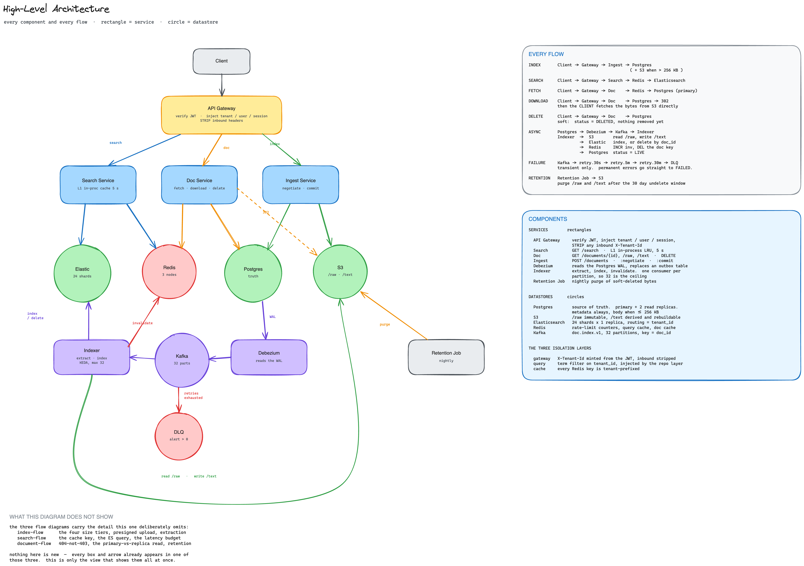
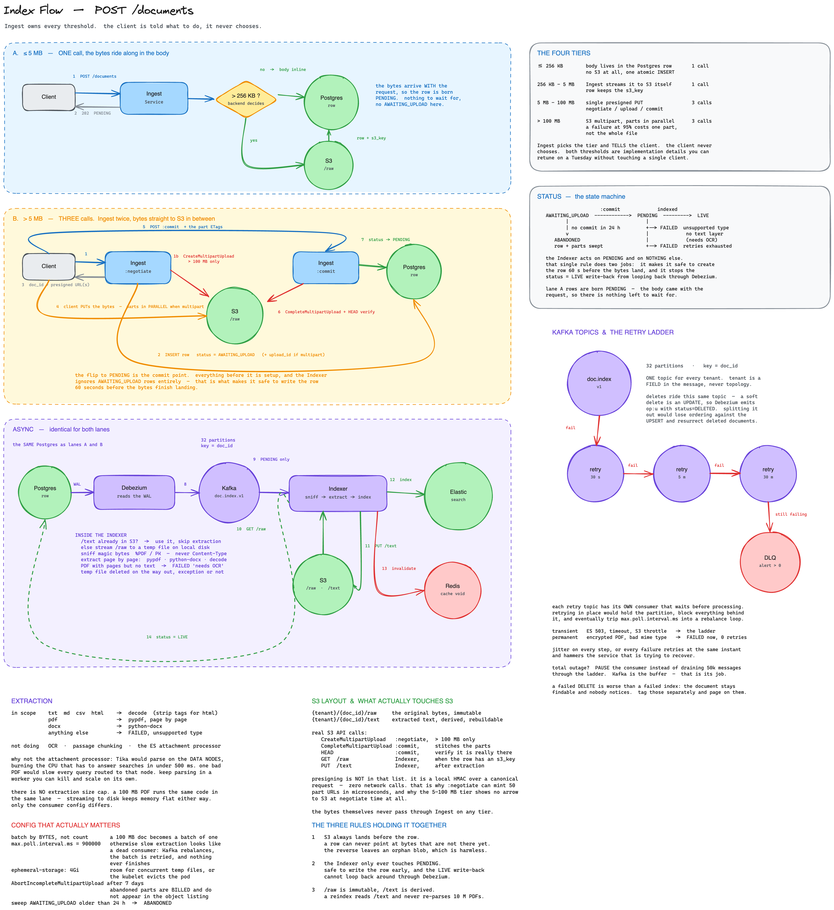
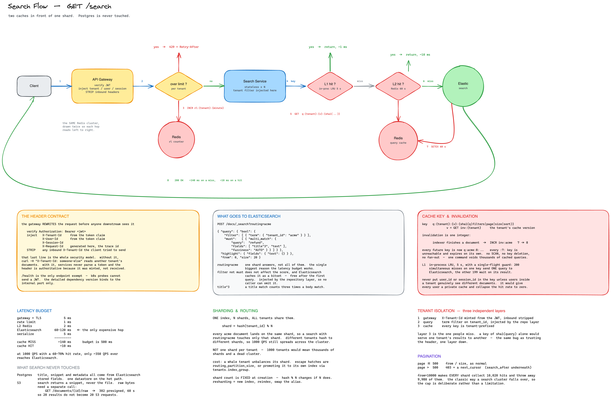

# Distributed Document Search — Design

A prototype multi-tenant document search service: 10M+ documents, full-text
search with relevance ranking, p95 under 500 ms, 1000+ searches/sec, tenant
isolation, horizontal scale.

Working code, `docker compose up`, and a Postman collection are in this
repository — see the [README](README.md). This document is the reasoning
behind it.

**Recorded walkthroughs:** 🎥 [indexing architecture](https://www.loom.com/share/5a0ed4dddc584da3822e1221f36f6a6a) ·
🎥 [search architecture](https://www.loom.com/share/eabddd520637489ea87d590c932dc4b2) · 🎥 [application demo](https://www.loom.com/share/b500cedbf4aa4f3f84798247edb2cd8e)

| | |
| --- | --- |
| [1 · Architecture design](#1--architecture-design) | components, data flow, storage, API, consistency, caching, queue |
| [2 · Production readiness](#2--production-readiness) | scale, resilience, security, observability, performance, operations, SLA, cost |
| [3 · Experience showcase](#3--experience-showcase) | |
| [4 · AI tool usage](#4--ai-tool-usage) | |

---

# 1 · Architecture design

## The shape of the problem

Three requirements do most of the design work:

- **p95 < 500 ms at 1000 QPS** — the search path may touch exactly one
  datastore. Anything that joins across two is already over budget.
- **10M+ documents, multi-tenant** — tenant is a *query-time filter* problem,
  not a topology problem. One index, routed; not an index per tenant.
- **Documents, not strings** — the brief says search *documents*, so real
  files arrive: PDF, DOCX, HTML. Extraction is a pipeline stage, and it is
  slow and failure-prone, so it cannot be on the write path.

That last point produces the central split: **writes are asynchronous, reads
are synchronous.** Upload returns `202` once bytes are durable; indexing
happens behind a queue.



## Components

| | Role | Why this one |
| --- | --- | --- |
| **Gateway** | auth, request id, rate limit | one place that mints identity; downstream never trusts a client header |
| **API** | document, index, search blueprints | one deployable, three folder-level services — split later without rewriting |
| **Postgres** | source of truth, metadata | needs transactions and a real consistency story; search does not |
| **Elasticsearch** | the search index | BM25, analyzers, highlighting, faceting out of the box |
| **S3 (MinIO)** | document bytes | blobs do not belong in a database row |
| **Kafka** | the async boundary | durable buffer — "indexer is down" becomes lag, not loss |
| **Redis** | L2 cache, rate limits, invalidation | shared ephemeral state |

**Elasticsearch over Postgres full-text search.** Postgres FTS is genuinely
good and would work at 10M documents. It loses on three things the brief asks
for: relevance ranking that is tunable per field (`title^3`), analyzer control
(stemming, so `refunds` finds `refund`), and horizontal read scale — Postgres
FTS scales by making one box bigger. The brief says *scale horizontally as
document volume grows*, and that is the deciding line.

**Postgres remains the source of truth.** Elasticsearch is a derived index.
That single decision pays out repeatedly below: it is why Elasticsearch needs
no backups, why a mapping change is safe, and why search survives a Postgres
outage.

## Data flow — indexing



Talked through in the 🎥 [indexing walkthrough](https://www.loom.com/share/5a0ed4dddc584da3822e1221f36f6a6a); full detail in
[resources/index-flow.md](resources/index-flow.md).

```
POST /documents  →  bytes durable  →  Postgres row + outbox row (ONE txn)  →  202
                                              │
                    Kafka  ◀── relay ─────────┘
                      │
                   Indexer  →  extract text  →  S3 /text  →  Elasticsearch
                                                                │
                                              INCR inv:{tenant} ┘   → status LIVE
```

Three rules hold the pipeline together:

1. **S3 lands before the row.** A row can never point at bytes that do not
   exist. The reverse leaves an orphan blob, which is harmless and sweepable.
2. **Document row and outbox row commit in one transaction.** There is no dual
   write, so there is no window where Postgres says a document exists and
   Kafka never hears about it. In production Debezium reads the WAL directly;
   the prototype polls the outbox with `FOR UPDATE SKIP LOCKED`.
3. **`/raw` is immutable, `/text` is derived.** A reindex reads the cached
   extracted text and never re-parses 10M PDFs.

Size decides the path, and **the server decides, never the client**:

| | |
| --- | --- |
| ≤ 256 KB | body inline in the Postgres row |
| > 256 KB | S3, row carries the key |
| > 5 MB | presigned PUT direct to S3 *(designed; prototype streams through the API)* |

Extraction failures are outcomes, not errors: a scanned PDF with no text layer
becomes `FAILED: needs OCR` and is visible in the UI, rather than an empty
document that silently matches nothing.

## Data flow — search



Talked through in the 🎥 [search walkthrough](https://www.loom.com/share/eabddd520637489ea87d590c932dc4b2); full detail in
[resources/search-flow.md](resources/search-flow.md).

```
GET /search  →  L1 (in-process, 5s)  →  L2 (Redis, 60s)  →  Elasticsearch, routed
                     ~0.1 ms                 ~2 ms              60–120 ms
```

**Search never touches Postgres and never touches S3.** Titles, snippets and
metadata all come from Elasticsearch stored fields. That is the design
decision that makes the latency budget work — and, as a side effect, the
reason search stays up when Postgres does not.

```json
POST /docs/_search?routing=acme
{
  "query": { "bool": {
    "filter": [ { "term": { "tenant_id": "acme" } } ],
    "must":   [ { "multi_match": { "query": "refund",
                                   "fields": ["title^3", "text"],
                                   "fuzziness": "AUTO" } } ]
  }},
  "highlight": { "fields": { "text": {} } }
}
```

| | |
| --- | --- |
| `routing=acme` | one shard answers instead of all 24 — the reason the budget works |
| `filter`, not `must` | the tenant term is unscored and cached as a bitset |
| `title^3` | a title match counts three times a body match |

Fuzzy matching, highlighting and faceting are the bonus features, and they are
one query away because the engine choice already paid for them.

## API design

Tenancy is never a URL parameter. It is a JWT claim, converted at the gateway
into `X-Tenant-Id` and forwarded; any inbound `X-Tenant-Id` from a client is
stripped.

| | |
| --- | --- |
| `POST /auth/login` | → `{ access_token, expires_in }` |
| `POST /documents` | multipart or JSON → `202 { doc_id, status }` |
| `GET /documents` | paginated list |
| `GET /documents/{id}` | metadata, or bytes via `Accept` |
| `GET /documents/{id}/raw` | `302` → presigned S3 URL, 60 s |
| `DELETE /documents/{id}` | soft delete → propagates to the index |
| `GET /search?q=&page=&size=` | the hot path |
| `GET /healthz` `/readyz` `/metrics` | operational |

```jsonc
// GET /search?q=refund
{
  "took_ms": 9,
  "total": 42,
  "cache": "hit",
  "results": [
    { "doc_id": "…", "title": "Refund Policy", "score": 8.41,
      "highlight": "…customers may request <em>refunds</em> within 30 days…" }
  ]
}
```

Errors are RFC 7807, and never leak internals. Every response carries the
`X-Request-Id` that also appears in logs on both sides of Kafka.

Contracts and 29 assertions live in
[postman/deeprunner.postman_collection.json](postman/deeprunner.postman_collection.json).

## Consistency model

**Postgres is strongly consistent. Search is eventually consistent.** A
document is durable and fetchable by id the instant `POST /documents` returns
`202`; it becomes *searchable* about a second later.

That is a deliberate trade, and it is the right one here: making search
read-your-writes would mean synchronous indexing, which puts PDF extraction on
the request path and blows the 500 ms budget on the write side to fix a
problem nobody has. Nobody uploads a document and immediately full-text
searches for it — but they do immediately look at it, which is why
`GET /documents/{id}` reads Postgres and is strongly consistent.

The status field makes the lag **visible rather than mysterious**:
`PENDING → LIVE`, or `FAILED` with a reason. The UI shows it.

Delivery is **at-least-once**, so every consumer operation is idempotent: an
upsert keyed by `doc_id`, and deleting something already gone is a no-op.
Elasticsearch `version_type=external` drops a stale event that overtakes a
newer one.

| Trade | Chosen | Cost |
| --- | --- | --- |
| Search freshness vs write latency | async index | ~1 s until searchable |
| Duplicated storage vs join cost | denormalise into ES | index is ~600 GB |
| At-least-once vs exactly-once | at-least-once + idempotency | must design for replay |
| Cache staleness vs hit rate | 5 s L1, 60 s L2 versioned | up to 5 s stale |

## Caching

Three layers, each with a different job:

| | Where | TTL | Invalidation |
| --- | --- | --- | --- |
| **L1** | in-process LRU | 5 s | none — it just expires |
| **L2** | Redis | 60 s | version counter |
| **ES** | shard request cache, filter bitsets | — | automatic |

L1 absorbs bursts: fifty people searching the same term within five seconds
produce one L2 lookup. Its TTL is short precisely *because* it cannot be
invalidated — there is no cheap way to tell twenty pods to drop a key, so the
staleness is bounded instead and self-corrects.

**Invalidation is one integer.** The cache key embeds a version:

```
q:{tenant}:{version}:{sha1(q|filters|page|size|sort)}
```

When the indexer finishes a document it runs `INCR inv:acme`. Every subsequent
key is built at `:8:`, so every `:7:` key is unreachable and expires on its
own. No `SCAN`, no key enumeration, no fan-out — one command voids a tenant's
entire cached search space.

Everything that changes the answer goes in the key; nothing else does. Omit
`page` and page 2 serves page 1. Include `request_id` and the hit rate is
zero. Omit `tenant` and you have a cross-tenant data leak — which is the
isolation layer people forget.

Measured: ~90% hit rate under load, so ~350 of 1000 QPS actually reach
Elasticsearch.

## Message queue

Kafka is the boundary between "durable" and "searchable".

| | |
| --- | --- |
| Topic | `doc.index.v1` + retry ladder + DLQ |
| Partitions | 32 |
| Key | **`doc_id`** |

**One topic for all tenants.** Tenant is a field in the message, not topology.
Topic-per-tenant makes signup an infrastructure operation and turns 32
partitions into 32,000.

**The key is `doc_id`, deliberately the opposite of the Elasticsearch routing
key.** Routing wants to *co-locate* a tenant; Kafka wants to *spread* work.
Keying on tenant would drop a whale tenant's whole corpus into one partition —
head-of-line blocking while 31 sit idle. Keying on `doc_id` still gives the
only ordering that matters:

```
doc-1:  UPSERT v1  →  UPSERT v2  →  DELETE v3
```

All three land in one partition, in order. Reorder them and the delete
overtakes v2 — a resurrected document. Nothing needs cross-document ordering.

Deletes share the topic for exactly that reason: a soft delete is an `UPDATE`,
so it is the same event shape, and a separate topic would destroy the ordering
the key exists to guarantee.

**Failures are classified before they are retried.** An encrypted PDF retried
five times reaches the same answer several minutes later with everything
behind it delayed, so permanent failures go straight to `FAILED`. Transient
ones move to a retry ladder — `30s → 5m → 30m` — on *separate topics*, so the
main partition commits and keeps moving. The window is sized to outlast a
rolling Elasticsearch restart.

And when Elasticsearch is down entirely, the correct response is not to retry
50,000 messages: **pause the consumer, let lag build, resume on health.** Kafka
is a buffer; absorbing this is its job.

One alerting consequence is worth stating: **a failed delete is worse than a
failed index.** A missing document generates a complaint. A deleted document
that is still findable generates nothing — it is a privacy incident wearing a
queue metric's clothing. Hence: alert on DLQ depth > 0, not > 100.

---

# 2 · Production readiness

What this prototype would need to run for real. Written against what is
actually built — where something exists it says so, and where it does not, it
says what would change rather than gesturing at a best practice.

## 2.1 Scalability — surviving 100×

100× the brief is **1B documents and 100k searches/sec**. Full derivation in
[resources/sizing.md](resources/sizing.md); the shape of the answer:

| | Today (10M / 1k QPS) | At 100× | Changes shape? |
| --- | --- | --- | --- |
| Elasticsearch | 6 data nodes, 24 shards, 600 GB | ~60 TB — hot/warm tiering, whales on dedicated indices, ~200 data nodes | **yes** |
| API | 6 pods → 30 | ~100 pods | no |
| Redis | 3 nodes, ~250 MB | ~21 GB, 6-shard cluster | no |
| Postgres | one primary, ~15 GB metadata | ~1.5 TB — hash partitioning becomes mandatory | somewhat |
| Kafka | 32 partitions | **partition count is the ceiling** | **yes** |

Only two things genuinely change shape.

**Elasticsearch.** 60 TB does not sit on one tier. Recent documents stay on
hot nodes with fast disk; older ones move to warm. Tenants above ~5M documents
get promoted to their own index via `tenants.index_group` — the column exists
today, unused, precisely so this needs no migration.

**Kafka partitions.** One consumer per partition, so 32 partitions caps the
indexer at 32 pods. Past that you must add partitions, and `hash(key) % N`
means a document's events could briefly straddle old and new ones. Survivable
(the version guard drops stale events) but it is a planned operation, not a
slider. Size partitions for the ceiling you expect, not the load you have.

Everything else scales by adding replicas, because the services hold no state.
The reason that is true is the reason it stays true: session, cache and
identity all live outside the process.

**The one thing that does not scale by adding pods** is the initial backfill.
Indexing 1B documents at ~1 s of extraction CPU each is ~30 CPU-years. That is
a migration project with its own capacity plan, not a deployment.

## 2.2 Resilience

**Built:** retry with exponential backoff and jitter, a retry-topic ladder so a
slow message never blocks a partition, a DLQ, and the transactional outbox that
makes "Kafka is down" mean lag rather than loss.

### The degradation matrix

The useful question is not "is it up" but "what still works". Answer this
before an incident, not during one:

| Down | Search | Upload | Fetch | Notes |
| --- | --- | --- | --- | --- |
| Redis | ✅ slower | ✅ | ✅ | cache miss is not an error — **must** be coded as a fallback, not a dependency |
| Elasticsearch | ❌ | ✅ | ✅ | writes keep landing; the queue absorbs and drains on recovery |
| Kafka | ✅ | ✅ | ✅ | outbox rows accumulate; `outbox_unpublished_depth` climbs |
| Indexer | ✅ | ✅ | ✅ | documents stay `PENDING`, consumer lag climbs |
| S3 | ✅ | ⚠ small only | ⚠ metadata only | large uploads fail, downloads 503 |
| Postgres | ✅ | ❌ | ❌ | search survives because it never touches Postgres |

Two rows are load-bearing design decisions rather than luck. **Search survives
a Postgres outage** because results come from Elasticsearch stored fields —
that is why the hot path deliberately touches one datastore. And **uploads
survive an Elasticsearch outage** because indexing is asynchronous.

The Redis row is the one most easily got wrong in code: a cache client that
raises on connection failure turns an optional dependency into a required one.

### Circuit breakers

Retries help a single failing request against a healthy service. They actively
hurt when the service is *down* — 50k messages each burning three backoffs is
a self-inflicted thundering herd.

```
gateway → api           5 failures in 10s → open 30s → half-open probe
api     → Elasticsearch same, and search returns 503 with Retry-After
api     → Redis         open immediately, fall through to Elasticsearch
indexer → Elasticsearch pause the consumer entirely; Kafka is the buffer
```

### Failover

| | Mechanism | RTO |
| --- | --- | --- |
| Postgres | Multi-AZ with automated promotion (RDS, or Patroni self-managed) | 60–120 s |
| Elasticsearch | replica shards across 3 AZs, automatic promotion | seconds |
| Redis | Cluster with replicas, automatic failover | seconds |
| Kafka | replication factor 3, `min.insync.replicas=2` | seconds |
| Services | ≥2 replicas per AZ, k8s reschedules | seconds |

`min.insync.replicas=2` with `acks=all` is the setting that makes "we told the
client 202" honest — the producer already uses `acks=all`.

### The largest gap

**Idempotency.** Uploading the same file twice creates two documents. The
design calls for an `Idempotency-Key` deduped in Redis for 24h plus a
`UNIQUE (tenant, checksum_sha256)` constraint; neither exists. This is the
biggest resilience gap, because at-least-once delivery plus client retries
makes duplicates a certainty rather than a risk.

## 2.3 Security

### Authentication

Today the gateway mints RS256 tokens itself. Production replaces that with an
OIDC provider (Cognito, Auth0, Keycloak) — the verification path is unchanged,
because it already fetches JWKS and validates `iss`, `aud`, `exp` and
signature.

**RS256, never HS256.** With a shared secret, every service able to *verify* a
token can also *mint* one for any tenant.

Tokens are 15 minutes. Revocation needs three layers, since a JWT cannot be
un-issued: short expiry, a `jti` denylist in Redis for emergencies, and the
tenant status check that already runs on every request.

### Authorisation and tenant isolation

Four independent layers, so no single mistake is sufficient:

```
1  gateway   tenant comes from the JWT claim; a client-supplied header is never read
2  service   each verifies the token again — reaching a service directly cannot forge identity
3  query     term filter injected by the repository layer; handlers cannot construct an unscoped query
4  cache     every Redis key is tenant-prefixed
```

Plus **404-not-403** on cross-tenant reads, so id enumeration reveals nothing —
not even whether a document exists.

To add in production: **Postgres row-level security** as a fifth layer, so even
a hand-written query in a migration or an admin script is scoped; and
**per-tenant KMS keys** on the S3 prefix, so a bucket-policy mistake fails
closed.

### Encryption

| | |
| --- | --- |
| In transit, edge | TLS 1.3 at the ALB, HSTS |
| In transit, internal | mTLS between services — currently plaintext on the compose network |
| At rest, Postgres | encrypted volumes, encrypted snapshots |
| At rest, S3 | SSE-KMS, per-tenant key |
| At rest, Elasticsearch | encrypted volumes |
| At rest, backups | encrypted, separate key, separate account |

The extracted-text copy in S3 (`/text`) needs the same protection as `/raw` —
it is the *searchable* content, so it is at least as sensitive as the original.

### Secrets

`.env` is fine for compose and unacceptable in production. Secrets Manager or
Vault, injected at runtime, never baked into an image, rotated on a schedule,
with short-lived dynamically issued database credentials.

Notably the RS256 private key is already never written to disk — it is
generated in memory at startup. That property should survive the move to an
external IdP.

### API surface

**Built:** per-tenant rate limiting, Pydantic validation on every input, a
20 MB body cap, RFC 7807 errors that never leak internals, presigned URLs
scoped to one object with a 60 s TTL.

**To add:** a WAF at the edge, per-endpoint rate limits (search and upload have
very different cost profiles), request size limits at the ALB rather than only
in the app, and dependency plus container image scanning in CI.

**Audit logging** is missing and would be required by most enterprise buyers:
who read which document, when, from where — written to append-only storage the
application itself cannot rewrite.

## 2.4 Observability

Built, and covered in the [README](README.md#observability): Prometheus metrics
with RED per route, Loki for structured logs searchable by `request_id`,
Grafana over both, and correlation that survives the Kafka boundary.

The instrumentation principle: **measure what fails silently.** A failed index
produces a complaint; a stuck relay, a lagging consumer and a dead-lettered
delete do not.

**Missing: distributed tracing.** `request_id` gives causality but not timing
per hop — you can see that a request touched three services, not that
Elasticsearch took 40 ms of its 140 ms. OpenTelemetry auto-instruments Flask,
SQLAlchemy, Redis and Elasticsearch with no code change; the manual part is
propagating `traceparent` across Kafka, since auto-instrumentation stops at the
producer.

**Missing: alerting.** Metrics exist, alert rules do not. The minimum set is
SLO burn-rate on search latency and availability, `outbox_unpublished_depth`
climbing, consumer lag climbing, and **DLQ depth > 0**.

## 2.5 Performance

### Measured

`p95 /search = 9 ms` against a 500 ms budget, ~90% cache hit rate under load.
Reproducible with `./scripts/bench.sh`.

One optimisation is worth recording because the method matters more than the
result. Search p50 was **44.6 ms**, and my first hypothesis — HTTP connection
pooling — was simply wrong when measured: 1.3 ms unpooled vs 0.8 ms pooled.
Bisecting hop by hop found `keys.public_key()` re-parsing the RSA PEM on
**every authenticated request** at 34.5 ms — more than Postgres, Redis and
Elasticsearch combined. Caching the derived key took p50 to **11.7 ms**, a 74%
reduction.

The lesson is the ordering: measure, then optimise. The plausible explanation
was the wrong one, and it would have been an afternoon spent on connection
pooling for a 0.5 ms return.

### Database

Indexes match the access patterns: `(tenant, updated_at DESC)` for listing, a
partial index on the non-`LIVE` ops backlog, GIN with `jsonb_path_ops` for
metadata, and a partial index on unpublished outbox rows so the relay never
scans the whole table.

At scale: PgBouncer in transaction mode (thousands of pods against a few
hundred connections), and read replicas for anything that tolerates lag —
noting that `GET /documents/{id}` deliberately does **not**, because it is the
endpoint clients poll immediately after writing.

### Index management

Shard count is immutable, so resharding means building a new index and swapping
an alias — which is why `docs-search` is an alias rather than a concrete index
name from day one. Add ILM for retention, force-merge read-only indices, and
monitor shard size against the 10–50 GB target.

### Query

**Already:** `routing=tenant` so one shard answers instead of all; `filter`
rather than `must` for the tenant term, so it is unscored and cached as a
bitset; snippets from stored fields rather than fetching bodies; deep
pagination capped at page 500 with a cursor beyond.

**Next:** `search_after` cursors wired end to end, `_source` filtering to
return only the fields the client renders, and adaptive replica selection.

## 2.6 Operations

### Deployment

Rolling updates by default — services are stateless with readiness gates, so
k8s drains connections and replaces pods with no downtime. Two replicas minimum
per AZ so a rolling deploy never drops below capacity.

**Blue-green earns its place in exactly one case: a mapping change.**
Elasticsearch mappings are largely immutable, so changing an analyzer or a
field type means reindexing:

```
1  create docs-v2 with the new mapping
2  backfill from Postgres + S3 /text  (which is why /text is cached)
3  dual-write both indices while the backfill catches up
4  compare counts and spot-check relevance
5  swap the docs-search alias atomically — instant, and instantly reversible
6  keep docs-v1 for a week, then drop it
```

The alias swap is the cutover. Rollback is the same command with the old name,
which is what makes the change safe to attempt on a Tuesday.

### Migrations

`create_all()` at startup is prototype-only; production needs Alembic with the
**expand/contract** pattern, because rolling deploys mean old and new code run
simultaneously:

```
expand    add the nullable column, deploy, backfill
migrate   deploy code that writes both and reads new
contract  drop the old column in a later release
```

Never a destructive migration in the same deploy as the code that depends on it.

### Backup and recovery

| | Method | RPO | RTO |
| --- | --- | --- | --- |
| Postgres | continuous WAL archiving, PITR | < 5 min | ~30 min |
| S3 | versioning + cross-region replication | ~15 min | minutes |
| Elasticsearch | snapshots to S3 — **or rebuild** | n/a | hours |
| Redis | none needed | n/a | instant |

The interesting rows are the last two. **Elasticsearch does not strictly need
backups** — it is derived from Postgres and S3, so the recovery plan is a
reindex. Snapshots optimise restore time; they are not a correctness
requirement. **Redis holds only caches and rate-limit counters**; losing it
costs a cold cache for sixty seconds.

That asymmetry is the payoff for keeping one authoritative source. Backup
strategy follows from architecture rather than being bolted on.

Restores must be **tested on a schedule**. An untested backup is a hypothesis.

### Runbooks

Each known failure mode needs one, and the metrics already point at them:
outbox depth climbing (relay stuck), consumer lag climbing (indexer behind),
DLQ non-empty (poisoned message), `FAILED` backlog growing (extraction breaking
on a document class), cache hit ratio collapsing (invalidation storm or a cold
cluster).

## 2.7 SLA — reaching 99.95%

**21.9 minutes of downtime per month.** Deployments count, so anything short of
zero-downtime deploys eats the budget outright.

### The arithmetic

Serial dependencies multiply, so the search path is only as good as its chain:

```
gateway (multi-AZ, ≥4 replicas)     99.99%
api     (multi-AZ, ≥6 replicas)     99.99%
Elasticsearch (3 AZ, replicas)      99.95%
                                    ───────
composite                           99.93%   ← under target
```

**Elasticsearch is the binding constraint**, so that is where redundancy
investment goes: more replica shards, three availability zones, and dedicated
master nodes so a data-node problem cannot take out cluster coordination.

Redis is deliberately absent from that chain — it degrades to a cache miss
rather than an error, which is worth more to availability than any amount of
Redis redundancy.

### Defining the SLI honestly

```
availability = successful searches / total searches
```

Excluding 4xx, which are the client's problem, and counting a **degraded search
that returns results slowly as a success**. A latency SLO sits alongside it:
95% of searches under 500 ms.

Writes get a separate objective, because they have a different failure profile
and a different tolerance — a `202` that eventually indexes is a success even
if the indexer was briefly behind.

### Spending the budget deliberately

21.9 minutes a month is a budget, not a target. Burn-rate alerting (fast burn
over an hour, slow burn over six) tells you whether an incident threatens the
month. When the budget is healthy, ship. When it is nearly spent, freeze risky
changes — that is the mechanism that makes the number mean something rather
than being a slide.

## 2.8 Cost

Roughly, at the brief's scale on AWS:

| | Monthly |
| --- | --- |
| Elasticsearch — 6 data + 3 master + 2 coord | ~$2,400 |
| Postgres — Multi-AZ, 250 GB | ~$700 |
| Kafka (MSK) — 3 brokers | ~$450 |
| Redis (ElastiCache) — 3 nodes | ~$250 |
| Compute — API + indexer pods | ~$500 |
| S3 — 100 GB plus requests | ~$10 |
| **Total** | **~$4,300** |

Elasticsearch is 56% of it, so that is where optimisation pays.

**Cache harder.** The hit rate is already ~90%; every point above that removes
traffic from the most expensive component.

**Hot/warm tiering.** Most searches touch recent documents. Older shards move
to cheaper nodes with slower disk.

**Right-size on measurement, not on guesses.** The shard count derives from an
assumed 50 KB of extracted text per document. Measure a 10k-document sample
first — at 5 KB the cluster is a third the size, and shard count cannot be
changed later without a reindex.

**Spot instances for the indexer.** It is interruption-tolerant by
construction: Kafka redelivers anything a killed worker did not commit. That is
roughly 70% off the one workload that can safely take it, and it is a direct
consequence of the at-least-once design.

**S3 is a rounding error** — 100 GB of documents costs about $2. Keeping bytes
out of the database is cheap in every dimension.

---

# 3 · Experience showcase

<!--
    To be written.
-->

---

# 4 · AI tool usage

<!--
    To be written.
-->

---

## Assumptions

The brief leaves these open; each is a decision, not a given.

| | Assumed | Why it matters |
| --- | --- | --- |
| Document size | real files up to ~100 MB | drives the 256 KB / 5 MB storage split and the extraction stage |
| Formats | pdf, docx, txt, md, csv, html — **no scanned images** | OCR is out of scope; a PDF with no text layer becomes `FAILED: needs OCR` |
| Extracted text | ~50 KB per document | the shard-count input; the number most worth verifying against real data |
| Search semantics | lexical (BM25), not semantic | the brief says full-text search with relevance ranking |
| Read-your-writes | not required for search | permits async indexing; `GET /documents/{id}` *is* strongly consistent |
| Tenant scale | thousands of tenants, skewed | one routed index, with a promotion path for whales |
| Users per tenant | all users see all tenant documents | no per-user ACL, so the cache key needs no user dimension |

## What is not built

Named plainly rather than left to be discovered: no idempotency on upload, no
integration tests against real infrastructure, no OCR or passage chunking, no
distributed tracing, no alert rules, no audit log. Presigned direct-to-S3
upload is designed and diagrammed but the prototype streams through the API
instead.

There are 229 unit tests (`pytest`, ~4 s, no infrastructure required) covering
the invariants this document argues for — tenant isolation in the cache key,
`filter`-not-`must`, the indexer's `PENDING` gate, S3-before-row ordering, the
HS256 confusion attack, and the OCR guard. Each was verified by mutation:
breaking the invariant makes a test fail. See the [README](README.md#tests).
