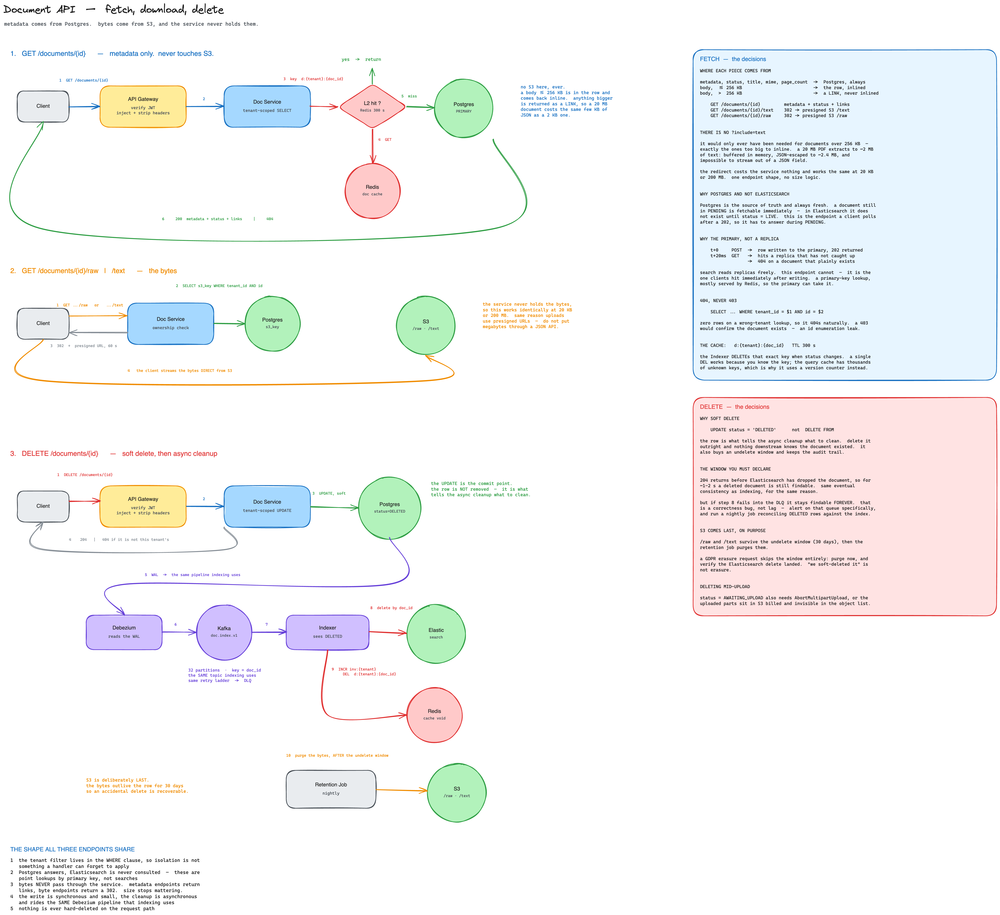

# Deeprunner

A multi-tenant document search service. Upload a PDF, DOCX or HTML file; the
text is extracted asynchronously and becomes full-text searchable with
relevance ranking, highlighting and facets — scoped to your tenant and nobody
else's.

Built against these targets: **10M+ documents · 1000+ searches/sec · p95 under
500 ms · tenant isolation · horizontal scale.**

Measured on this prototype: **p95 `/search` = 9 ms**, cache hit ~90%.

---

## Quick start

```bash
git clone <repo> && cd deeprunner
cp .env.example .env          # dev values, no real secrets
docker compose up -d          # ~2 min on first pull
```

Open **http://localhost:3001** and sign in.

| Email | Tenant | Password | |
| --- | --- | --- | --- |
| `alice@acme.com` | acme | `demo` | 600 req/min |
| `bob@globex.com` | globex | `demo` | a second tenant, for proving isolation |
| `carol@initech.com` | initech | `demo` | **suspended** — login returns 403 |

Everything else:

| | | |
| --- | --- | --- |
| App | http://localhost:3001 | |
| Grafana | http://localhost:3000/d/deeprunner/deeprunner | no login |
| Prometheus | http://localhost:9090 | |
| MinIO (S3) | http://localhost:9001 | `minioadmin` / `minioadmin` |
| Elasticsearch | http://localhost:9200/_cat/indices?v | |
| Kafka UI | http://localhost:8090 | `docker compose --profile devtools up -d` |

---

## Try it in five minutes

1. **Upload a PDF** — *Add document*. The detail page shows three stages:
   `Stored → Queued for indexing → Searchable`. Each reads a real signal (the
   committed row, `outbox.published_at`, then `status = LIVE`), not a timer.

2. **Search a phrase from inside the file.** The chip says `MISS`. Search the
   same thing again → `HIT`, and the latency drops from ~15 ms to single
   digits.

3. **Copy the Document ID** off the detail page, then find the same UUID in
   MinIO (`acme/<id>/raw` and `/text`), in the Kafka message key, and in
   Elasticsearch (`_id` = `acme:<id>`).

4. **Prove isolation.** Sign out, sign in as `bob@globex.com`, run the same
   search → zero results. Paste one of alice's document URLs → **404, not
   403** (a 403 would confirm the document exists).

5. **Break something on purpose.** Upload a scanned PDF with no text layer →
   `FAILED: no text layer — this document needs OCR`, and the stepper stops at
   the stage that broke.

```bash
./scripts/smoke.sh     # 19 end-to-end assertions
./scripts/bench.sh     # search p50/p95, split by cache hit and miss
./scripts/loadgen.sh   # traffic, so the dashboards have something to show
```

---

## API

The full request set is a Postman collection:

**[`postman/deeprunner.postman_collection.json`](postman/deeprunner.postman_collection.json)**

Import it, run **Auth → Log in (acme)** first — it stores the JWT in a
collection variable every other request uses — then work through the folders.

| Folder | |
| --- | --- |
| **Auth** | login, the suspended tenant, a bad password, JWKS |
| **Documents** | index text, index >256 KB (goes to S3), upload a file, get, list, download, delete |
| **Search** | ranked and faceted, fuzzy off, deep-page rejection |
| **Tenant isolation** | globex reading acme's document, and searching for it |
| **Health** | liveness and dependency status |

Every request carries assertions, so the collection doubles as an end-to-end
test. Run it headless:

```bash
npx newman run postman/deeprunner.postman_collection.json
```

```
requests    21
assertions  29        0 failed
duration    1.3s
```

`baseUrl` defaults to `http://localhost:3001/api`, the frontend origin that
proxies to the gateway. Point it at `http://localhost:8080` to hit the gateway
directly.

Endpoints, for reference — everything except `/health` needs
`Authorization: Bearer <jwt>`, and **the tenant is never sent by the client**;
it is read from the token claim.

| Method | Path | |
| --- | --- | --- |
| `POST` | `/auth/token` | log in, 15-minute RS256 JWT |
| `GET` | `/search` | full-text, ranked, highlighted, faceted |
| `POST` | `/documents` | index — JSON body or `multipart/form-data` file |
| `GET` | `/documents` | list, paginated, filterable by status |
| `GET` | `/documents/{id}` | detail, including indexing progress |
| `GET` | `/documents/{id}/raw` | 302 to a presigned S3 URL, 60s |
| `DELETE` | `/documents/{id}` | soft delete |
| `GET` | `/health` | liveness · `/health/detail` for dependencies |

Errors are RFC 7807 `application/problem+json` and always carry `trace_id`.
A cross-tenant read returns **404, not 403** — a 403 would confirm the
document exists.

---

## Architecture


Six decisions worth knowing:

**Writes are asynchronous, and say so.** `POST /documents` returns **202
PENDING**, not 201. The document is durable but not yet searchable. Claiming
201 would promise something the write path hasn't delivered.

**The document row and its outbox row commit in one transaction.** No dual
write. Kafka being down means lag, never a lost document.

**Postgres is the source of truth; Elasticsearch is derived and disposable.**
Lose the index and you replay from Postgres + S3.

**Isolation has three layers** — tenant minted from the JWT claim (never a
client header), a mandatory `term` filter injected by the repository layer so
no caller can omit it, and tenant-prefixed cache keys. A cross-tenant read
returns **404, not 403**.

**Kafka is keyed on `doc_id`, not tenant.** Ordering only matters per
document — an `UPSERT` must not overtake the `DELETE` behind it. Keying on
tenant would drop a busy customer's whole corpus into one partition.

**Elasticsearch routes by tenant**, so a search touches one shard instead of
all of them. That is the main reason the latency budget holds.

### The flows in detail

| Flow | Diagram | Source | Written up |
| --- | --- | --- | --- |
| Write path — upload to searchable | [index.png](resources/index.png) | [.excalidraw](resources/index-flow.excalidraw) | [index-flow.md](resources/index-flow.md) |
| Read path — search | [search.png](resources/search.png) | [.excalidraw](resources/search-flow.excalidraw) | [search-flow.md](resources/search-flow.md) |
| Fetch, download, delete | [document.png](resources/document.png) | [.excalidraw](resources/document-flow.excalidraw) | — |
| Sharding and capacity | — | — | [sizing.md](resources/sizing.md) |

<details>
<summary><b>Write path</b> — the size tiers, the outbox transaction, extraction, retries and the DLQ</summary>


</details>

<details>
<summary><b>Read path</b> — two cache levels, the Elasticsearch query, the latency budget</summary>


</details>

<details>
<summary><b>Fetch, download and delete</b> — 404-not-403, the primary-vs-replica read, soft delete and retention</summary>


</details>

All four are exported from [excalidraw.com](https://excalidraw.com), where the
`.excalidraw` sources also open for editing.

---

## Layout

```
backend/
  common/            config · SQLAlchemy models · clients · auth · middleware
                     problem (RFC 7807) · observability
  gateway/           auth, rate limit, request-id, proxy      → container
  search_service/    ┐
  document_service/  ├ blueprints, mounted by backend/main.py → container
  index_service/     ┘
  indexer/           outbox relay + Kafka consumer + extraction → container
frontend/            React + TypeScript + Vite, nginx serves it and proxies /api
ops/                 prometheus, grafana, loki config
scripts/             smoke · bench · loadgen · es · pg
resources/           design docs and diagrams
```

Each service uses the same four layers: `routes` (URL mapping) → `handlers`
(HTTP marshalling) → `managers` (business logic) → `repositories` (data
access). No business logic in a handler; no SQL outside a repository.

**Three deployables, not five.** Search, document and index are separate
packages but one process — ingest is roughly a tenth of search traffic, so
splitting them would buy operational cost with no scaling benefit. The indexer
is separate because it is a queue consumer: it scales on lag, not request rate.

---

## Prototype vs production

Every row is a deliberate scope decision, not an unfinished one.

| | Prototype | Production |
| --- | --- | --- |
| Change capture | outbox table + polling relay | Debezium reads the WAL; the outbox table disappears |
| Upload | `multipart` through the API, 20 MB cap | presigned `:negotiate` → client PUTs to S3 → `:commit` |
| `AWAITING_UPLOAD` status | unreachable — only exists with presigned upload | the state between negotiate and commit |
| Download | **presigned 302, already built** | same |
| Scanned PDFs | `FAILED: needs OCR` | OCR on a separate worker pool and topic |
| Long documents | indexed whole | chunked into passages, collapsed by `doc_id` |
| Shards | 2 | 24 — see [sizing.md](resources/sizing.md) |
| Migrations | `create_all()` at startup | Alembic |
| Key management | RS256 keypair generated in-process | an OIDC provider (Cognito/Auth0/Keycloak) |
| Tracing | `request_id` correlated in logs, searchable in Grafana | OpenTelemetry spans, with `traceparent` carried across Kafka |

---

## Assumptions

The brief does not state document size or format. Everything below follows
from these, so they are the first things to challenge.

- **Documents are real files** — PDF, DOCX, HTML, plain text — not
  pre-extracted text snippets. This is what makes S3, the extraction step and
  the `/raw` + `/text` split necessary.
- **~50 KB of extracted text per document**, which drives the shard maths in
  [sizing.md](resources/sizing.md). At 5 KB it would be 3 shards, at 200 KB it
  would be 80. Measure before committing — shard count is immutable.
- **Bodies at or under 256 KB live in the Postgres row**, larger ones in S3.
  A backend detail; no client sees it.
- **Onboarding is out of scope** — tenants and users are seeded.
- **No OCR.** A scanned PDF is a visible `FAILED` state, not a silent empty
  document.

---

## Observability

```
metrics   Prometheus → Grafana    RED per route, cache hit ratio, outbox depth,
                                  consumer lag, documents by status
logs      Loki       → Grafana    structured JSON, searchable by request_id
traces    —                       not built; request_id correlation instead
```

The metrics that matter here are the ones revealing **silent** failure. A
failed index is visible — someone complains. A stuck relay, a lagging
consumer, or a failed *delete* leaving a document still findable are not.

One request id flows gateway → api → outbox row → Kafka message → indexer, so
a single grep follows a document from HTTP request to indexed:

```bash
docker compose logs gateway api indexer | grep r-f3219a8948b0
```

Or paste it into the **Request ID** box on the Grafana dashboard.

---

## Verifying it works

```bash
./scripts/smoke.sh    # 19 assertions: auth, isolation, cache, delete, rate limit
./scripts/bench.sh    # p50/p95 for /search, split by cache state
./scripts/es.sh       # indexes, shards, docs per tenant
./scripts/pg.sh       # tenants, storage split, outbox backlog
./scripts/pg.sh <id>  # one document and its outbox entries
```

A measured optimisation, reproducible with `bench.sh`: `keys.public_key()` was
re-parsing the RSA PEM on **every authenticated request** — 34.5 ms of the
44 ms budget. Caching the derived key took p50 from **44.6 ms to 11.7 ms**.
The first hypothesis (connection pooling) was wrong; bisecting hop by hop
found it.

---

## Not built

Stated plainly rather than left to be discovered:

- **Automated tests.** The smoke suite covers behaviour end to end, but there
  are no unit tests. This is the largest gap against "testable code".
- **Idempotency.** Uploading the same file twice creates two documents. The
  design calls for an `Idempotency-Key` deduped in Redis; it is not
  implemented.
- **OCR, passage chunking, presigned upload** — see the table above.
- **Per-tenant metrics.** `documents_by_status` has no tenant label, so
  Grafana counts across all tenants while the UI shows one.

---
